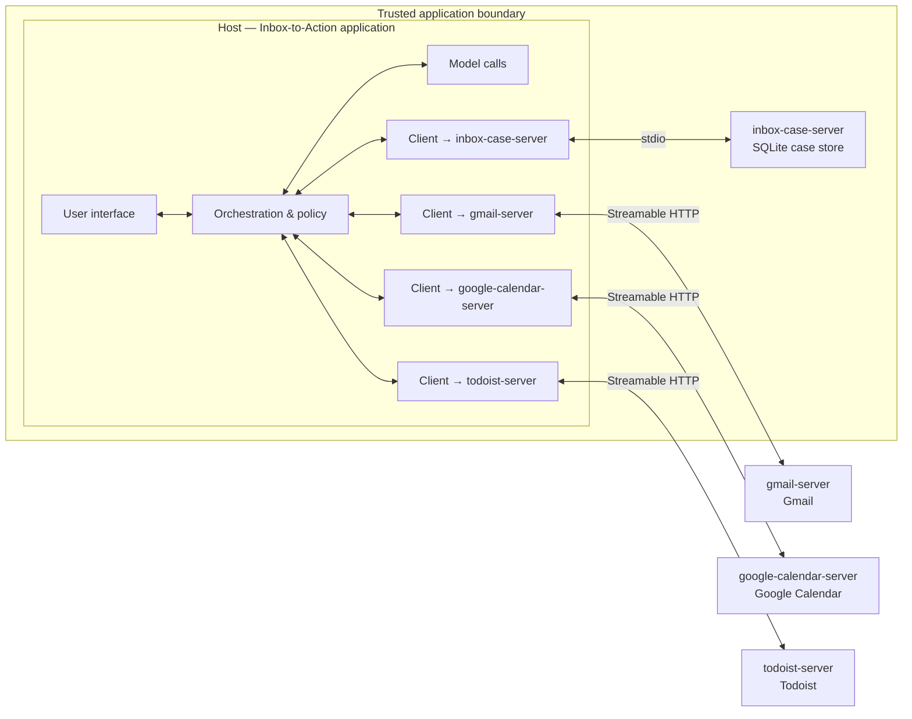

# MCP Architecture and Wire Lab

This artifact extends the [`MCP_CAPABILITY_MAP.md`](MCP_CAPABILITY_MAP.md) design. The architecture uses
the four inbox-workflow systems from that map; the wire exercises preserve the lab's supplied document
server so the messages can be compared directly with the reference capture.

## Part A — Architecture and stress test

### A1–A2. Host, explicit clients, servers, and transports



There is one client and one wire for each server. The model and orchestration components have no direct
server connection.

**Transport reasoning**

- `inbox-case-server` uses **stdio** because it is a local, single-user process shipped with the desktop
  application; the host owns its lifecycle and no network authentication is needed.
- `gmail-server`, `google-calendar-server`, and `todoist-server` use **Streamable HTTP** because they
  represent centrally hosted, multi-user vendor services requiring authentication, authorization, and
  transport security.

### A3. Responsibility placement

| # | Responsibility | Owner | Reason |
|---:|---|---|---|
| 1 | Decides that answering a question needs two systems | Host — orchestration & policy | Only the host has the aggregate view of all enabled capabilities. |
| 2 | Runs the SQL query | `inbox-case-server` | The server owns execution against its external SQLite system. |
| 3 | Matches response ID 7 to request ID 7 | Corresponding client | The client owns correlation for its single connection. |
| 4 | Asks the user to confirm an irreversible action | Host — orchestration & policy/UI | The host knows the user, intent, and conversation and can present consent. |
| 5 | Writes the model-facing description of `close_ticket` | Server exposing the ticket system | Capability description belongs with the domain owner that implements it. |
| 6 | Performs the capability handshake at startup | Corresponding client | The client owns connection lifecycle and negotiation. |
| 7 | Rejects a malformed `ticket_id` clearly | Server exposing the ticket system | The server validates inputs at the execution boundary. |
| 8 | Chooses which servers are enabled | Host — orchestration & policy | Enabling a server is an application trust and policy decision. |

### A4. Stress tests

#### 1. A server hangs

Only the client connected to `docs-server` is blocked; other clients and their capabilities remain
available. The host should enforce a timeout, mark document context unavailable, continue with any safe
partial answer, and state the limitation to the user rather than inventing document content. With one
client multiplexing three servers, the blocked connection or lifecycle could stall all three capability
sets and make targeted recovery much harder.

#### 2. A server lies

The host could prevent harm by refusing to enable an untrusted server, sandboxing it, requiring consent,
or restricting credentials and tool availability; independent review and integration tests could also
detect the mismatch before enablement. The client definitely could not infer that `archive_message`
actually deletes—the client moves protocol messages and has no semantic understanding. Third-party
servers therefore require provenance, code/vendor review, least privilege, testing, and explicit trust
decisions; MCP compliance is not proof of honesty.

#### 3. Two servers advertise `send_reply`

The host must resolve the ambiguity during capability aggregation and routing, normally by exposing a
namespaced identity such as `tickets.send_reply` versus `gmail.send_reply`. At minimum it must preserve
the tuple `(server/client identity, original tool name, tool schema)` for every advertised capability;
the bare name alone is insufficient to select a connection safely.

#### 4. A resource has a side effect

The host or user may preload, browse, refresh, cache, or re-read resources without model intent or
confirmation. Reading `tickets://ticket/{id}/claim` could therefore assign a ticket merely because the
application refreshed context, perhaps repeatedly or under the wrong user. The capability must be a
verb-first tool such as `claim_ticket`, routed through host policy and confirmation.

## Part B — Read and write the wire

### B1. Reading the capture

1. **Message counts:** five requests, five responses, and one notification. Requests have `method` and
   `id`; responses have the matching `id` plus `result` or `error`; the notification has `method` and no
   `id`.

2. **No response to message three:** `notifications/initialized` has no `id`, which makes it a
   notification. Notifications explicitly expect no response.

3. **Version negotiation:** a different version in the initialize response would be the server's
   selected mutually supported protocol version. The client must use that version if it supports it, or
   close the connection rather than continue with incompatible assumptions.

4. **Capabilities:** `prompts`, `resources`, and `tools` are present, so `prompts/*`, `resources/*`, and
   `tools/*` method families are safe to call after initialization. `tools.listChanged: false` means the
   client should not expect tool-list-change notifications; `resources.subscribe: false` means it may
   not subscribe to an individual resource. The `prompts` key does **not** prove a prompt is registered;
   only `prompts/list` reveals inventory.

5. **Schema origins:** `read_document` comes from the registered Python function name (or explicit
   decorator name); the tool description comes from its docstring/explicit description; and the
   `doc_id` description comes from parameter metadata such as an annotated field description. The SDK
   converts those declarations into JSON Schema.

6. **Result shape:** `content` is intended for model consumption. It is a list of typed blocks so one
   result can carry text, images, audio, or embedded resources; `structuredContent` is the parallel
   machine-readable value for application code.

7. **Resource versus tool result:** the resource response uses `contents`, not `content`; each entry
   includes its originating `uri`; and each entry declares a `mimeType` rather than using the tool
   block's `type`. A client must interpret or parse the `text` according to that MIME type—for
   `application/json`, parse the JSON string rather than display or treat it as arbitrary plain text.

8. **Unknown tool:** ID 5 has a valid JSON-RPC `result`, but `isError: true` says execution failed. This
   delivers useful failure context to the model so it can repair or retry; the client must inspect
   `result.isError` rather than assuming every result is successful.

9. **Object member order:** the position of `id` after `result` does not matter. JSON object members are
   unordered; names and values carry meaning, not textual order.

### B2. Hand-written JSON-RPC messages

#### 1. List prompts, request ID 10

```json
{"jsonrpc":"2.0","id":10,"method":"prompts/list","params":{}}
```

#### 2. Call `edit_document`, request ID 11

```json
{"jsonrpc":"2.0","id":11,"method":"tools/call","params":{"name":"edit_document","arguments":{"doc_id":"plan.md","old_text":"phase one","new_text":"phase 1"}}}
```

#### 3. Read the onboarding resource, request ID 12

```json
{"jsonrpc":"2.0","id":12,"method":"resources/read","params":{"uri":"docs://documents/onboarding.docx"}}
```

#### 4. Get `summarize_document`, request ID 13

```json
{"jsonrpc":"2.0","id":13,"method":"prompts/get","params":{"name":"summarize_document","arguments":{"doc_id":"plan.md","max_words":"40"}}}
```

Sending `40` as a JSON number would violate the prompt argument type (`string` values) and should be
rejected by client-side validation before transmission.

#### 5. Resource-list-changed notification

```json
{"jsonrpc":"2.0","method":"notifications/resources/list_changed"}
```

It must have no `id` because it reports an event and expects no response; adding an ID would turn it
into a request.

#### 6. Successful response to request ID 11

```json
{"jsonrpc":"2.0","id":11,"result":{"content":[{"type":"text","text":"Updated plan.md"}],"isError":false}}
```

#### 7. Protocol error response to request ID 12

```json
{"jsonrpc":"2.0","id":12,"error":{"code":-32602,"message":"Unknown document: onboarding.docx"}}
```

### B3. Diagnosing broken exchanges

#### Broken exchange A — initialization missing

The client sends `"method":"tools/list"` before completing `initialize` and
`notifications/initialized`. The server correctly reports that initialization is incomplete. Fix:
perform the full three-step handshake first, then issue `tools/list` with a fresh request ID.

#### Broken exchange B — stdout is corrupted

The line `Server started successfully!` is not a JSON-RPC message and was written to the stdio protocol
stream. The client attempts to decode it as JSON and fails. Fix: reserve stdout exclusively for
protocol messages and send logs to stderr through the logging framework.

#### Broken exchange C — duplicate live request IDs

Both `tools/call` requests use `"id":8`, destroying the client's only response-correlation key. It can
associate both responses with the same pending call, which explains the duplicated plan output. Fix:
assign a unique ID to every live request—for example IDs 8 and 9—and retain each mapping until its
response arrives.

## Part C — Trace one question through both layers

The document-server connection has already completed the startup handshake:

1. **Client** → REQUEST `initialize`, ID 1, over stdio.
2. **Server** → RESPONSE to `initialize`, ID 1, with negotiated version and capabilities.
3. **Client** → NOTIFICATION `notifications/initialized`, with no ID.
4. **Client** → REQUEST `tools/list`, ID 2.
5. **Server** → RESPONSE to `tools/list`, ID 2, advertising `read_document` and its schema.

The user interaction then proceeds:

6. **User** → asks, “What does the onboarding document say about laptops?”
7. **Host** → builds model context from the user message and tools discovered by each client.
8. **Model — A** → emits the intention `read_document(doc_id="onboarding.docx")`; nothing external has
   happened yet.
9. **Host** → applies policy, confirms that read access is allowed, resolves the advertised tool to the
   document client, and records a correlation/audit event.
10. **Client** → REQUEST `tools/call`, ID 7, over stdio with tool name `read_document` and argument
    `doc_id="onboarding.docx"`.
11. **Server** → receives `tools/call` and validates the tool name and argument schema.
12. **Server — B** → reads `onboarding.docx` from the real external document store.
13. **Server** → RESPONSE to `tools/call`, ID 7, containing typed `content`, optional
    `structuredContent`, and `isError:false`.
14. **Client** → correlates response ID 7 with its pending request and returns the result to the host.
15. **Host — C** → converts the content blocks into model context and invokes the model again.
16. **Model** → reasons over the returned document text and composes the answer about laptops.
17. **Host** → renders the answer to the user and completes the audit record.

Between A and B, the host may authorize or deny the operation, request consent, redact arguments,
select the correct server/client, log the intention, apply rate limits, or stop on policy grounds. That
is the correct enforcement point because the host uniquely knows the user and conversation; the model
only proposed text, while the server knows how to execute but not why the user is allowed to ask.

## Self-check

- Four clients have exactly one server wire each; neither model nor orchestration connects directly.
- All eight responsibilities appear once in the responsibility table.
- The lying-server answer assigns enablement to the host and says the client cannot detect semantics.
- All seven hand-written messages include `"jsonrpc":"2.0"`.
- The notification has no ID; all requests and responses use the specified IDs.
- `max_words` is the string `"40"`.
- Responses contain exactly one of `result` and `error`.
- Broken exchanges identify missing initialization, stdout corruption, and duplicate request IDs.
- Every trace line names a component; every protocol line names the method and message type.
- Marker B is on the server's external-system read.

## Stretch goals

### A second host demonstrates reuse

A Slack assistant can connect to `gmail-server` and `todoist-server` with two new in-host clients. No
server changes are required: two clients are added, while the two domain integrations remain reusable.

### Security boundary

The diagram's trusted boundary contains the inbox host and locally owned case server. Vendor/third-party
servers remain outside it. Before enabling one, verify publisher and code provenance, authentication
flow, requested scopes, data use and retention, residency, tool semantics, update channel, logging,
incident response, and a revocation/kill path.

### Degradation by server

- Gmail unavailable: “I cannot read the source thread or create a draft right now; no message was sent.”
- Case store unavailable: “I cannot create an auditable case, so I stopped before proposing actions.”
- Calendar unavailable: “I could not verify availability, so these dates remain unconfirmed.”
- Todoist unavailable: “The approved tasks were not created; I preserved them in the case for retry.”

### Failure branch: missing onboarding document

After the valid `tools/call`, the server responds:

```json
{"jsonrpc":"2.0","id":7,"result":{"content":[{"type":"text","text":"Unknown document: onboarding.docx"}],"isError":true}}
```

The client correlates ID 7, and the host returns the error content to the model. The model can then ask
to list available documents or explain that the document was not found; the host may allow a safe
`resources/read` or another tool call, but it must not fabricate the laptop policy.

### Useful notification

A feature-flag server whose available tools change during a connection sends:

```json
{"jsonrpc":"2.0","method":"notifications/tools/list_changed"}
```

On receipt, the client should call `tools/list` again, replace the cached inventory for that connection,
and notify the host to rebuild its namespaced capability catalog.

### Streamable HTTP mapping

The ID 11 `tools/call` message travels as an HTTP `POST` to the server's MCP endpoint, with the JSON-RPC
object in the request body and appropriate MCP/session, content-type, authentication, and protocol
headers. The JSON-RPC payload itself does not change; HTTP is only the transport carrying it.
