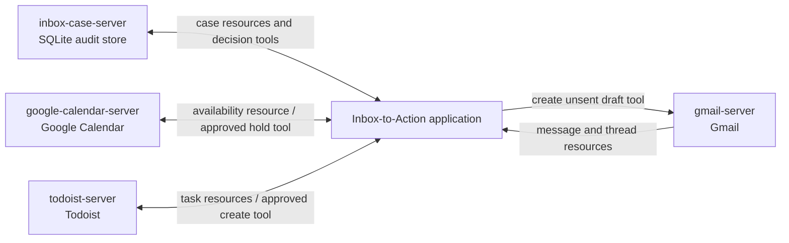

# MCP Capability Map — Inbox to Reviewed Action

## Workflow

**Review an incoming Gmail message, identify its actionable commitments, check scheduling constraints,
create approved tasks or calendar holds, and prepare a reply draft for human review.**

A competent person reads the message and its thread, separates requests from background information,
identifies owners and dates, checks the calendar and existing task list, and decides what needs action.
They correct ambiguous details, approve any task or calendar change, and review a reply draft before
sending it. This is a target-state paper design: the current application accepts pasted text, persists
locally, and never sends messages or changes external systems.

## External systems and ownership

| External system | Natural MCP server owner |
|---|---|
| Gmail mailbox used for the workflow | Google Workspace/platform team |
| Inbox assistant SQLite case and audit store | Inbox assistant application team |
| Google Calendar account | Google Workspace/platform team |
| Todoist workspace | Todoist integration/application team |

Each server below exposes exactly one external system. Authentication and authorization remain scoped
to the connecting user or workload identity; an MCP connection does not grant new authority by itself.

## Server specifications

### Server: `gmail-server`

**System:** Gmail mailbox  
**Likely owner:** Google Workspace/platform team  
**Purpose:** Read message context and create reviewable Gmail drafts without sending them.

**Tools**

- `create_draft(thread_id, subject, body)` — Creates an unsent reply draft in the specified Gmail
  thread and returns its draft ID; it never sends the message.

**Resources**

- `gmail://messages/{message_id}` — The selected message's sender, recipients, subject, received time,
  labels, and plain-text body.
- `gmail://threads/{thread_id}` — The ordered messages and metadata in one conversation thread.

**Prompts**

- `draft_reviewed_reply(message_id, tone)` — Fixed: use only grounded facts, do not claim completed or
  unauthorized actions, preserve human approval, and omit invented signatures. Parameters: source
  message and desired tone.

### Server: `inbox-case-server`

**System:** Inbox assistant SQLite case and audit store  
**Likely owner:** Inbox assistant application team  
**Purpose:** Preserve analyses, proposed actions, revisions, and human decisions as an auditable case.

**Tools**

- `save_analysis(message_id, analysis)` — Validates and records a structured analysis as pending human
  review; it does not approve an action.
- `record_decision(case_id, decision, note)` — Records a human approval or rejection with its note and
  before/after state.

**Resources**

- `inbox-cases://cases/{case_id}` — One case with source reference, analysis, draft, risks, status, and
  model identifier.
- `inbox-cases://cases/{case_id}/history` — The append-only sequence of revisions and decisions for one
  case.

**Prompts**

- `review_inbox_case(case_id)` — Fixed: check grounding, date certainty, authorization, missing actions,
  and unsafe commitments. Parameter: case to review.

### Server: `google-calendar-server`

**System:** Google Calendar account  
**Likely owner:** Google Workspace/platform team  
**Purpose:** Expose scheduling context and create explicitly approved tentative holds.

**Tools**

- `create_tentative_hold(calendar_id, start, end, title, approval_id)` — Creates a tentative calendar
  hold only when supplied with a valid recorded human approval.

**Resources**

- `gcal://calendars/{calendar_id}/availability/{date}` — Busy intervals and working-hour boundaries for
  the requested date, without unrelated event descriptions or attendees.
- `gcal://calendars/{calendar_id}/upcoming` — The user's upcoming event times and response status within
  the configured horizon.

**Prompts**

- `propose_meeting_times(calendar_id, duration_minutes, date_range, timezone)` — Fixed: respect working
  hours, existing busy periods, requested duration, and timezone; never create an event. Parameters:
  calendar, duration, date range, and timezone.

### Server: `todoist-server`

**System:** Todoist workspace  
**Likely owner:** Todoist integration/application team  
**Purpose:** Read existing commitments and create human-approved tasks without duplicating them.

**Tools**

- `create_task(content, due_date, project_id, source_message_id, approval_id)` — Creates one task from an
  approved action, using the source message ID as an idempotency reference.

**Resources**

- `todoist://projects/{project_id}/open-tasks` — Open tasks with ID, content, due date, assignee, labels,
  and source reference.
- `todoist://tasks/{task_id}` — One task's current fields and completion state.

**Prompts**

- `prepare_task_plan(case_id, project_id)` — Fixed: create concise action titles, preserve validated
  owners and dates, flag ambiguity, and avoid duplicates. Parameters: reviewed inbox case and target
  project.

## Architecture sketch

## Three hard calls

### 1. Calendar availability is a resource, not a tool

Availability requires parameters and may be fetched during a conversation, which can make it resemble
a tool. I classified it as a resource because reading it has no side effect and the application can
load it deliberately when scheduling context is needed. I rejected a `get_availability` tool because
that would unnecessarily give the model control over a safe context-loading decision and encourage the
common mistake of treating every dynamic lookup as an action.

### 2. Reply creation is a tool, while reply guidance is a prompt

Creating a Gmail draft changes mailbox state, so `create_draft` must be a tool even though it does not
send anything. The repeated house rules for writing the reply are instead the user-triggered
`draft_reviewed_reply` prompt. I rejected making the whole operation a prompt because prompts provide
instructions but cannot honestly represent the state-changing creation of a Gmail object; I also
rejected a `send_email` tool because the present workflow intentionally keeps final sending human-only.

### 3. Approval history is a resource, but recording approval is a tool

The case history is safe, read-only context that an application or auditor may load, so it is a
resource. Recording a decision changes the authoritative audit trail and therefore must be the
`record_decision` tool. I rejected a mutable “decision resource” because MCP callers are entitled to
assume resource reads have no side effects, and hiding an approval transition behind a read-shaped URI
would make both authorization and auditing misleading.

## Reuse beyond this application

A Slack-based personal operations assistant could reuse `gmail-server`, `google-calendar-server`, and
`todoist-server` unchanged. It would supply a different user interface and orchestration layer while
the domain-owning servers retain the same schemas, credentials, policies, and execution code. That is
the concrete M + N benefit: a second application does not rebuild three integrations.

## Highest-risk tool and application guardrail

`create_tentative_hold` has the greatest consequence because an incorrect time or calendar can expose
private context and disrupt other commitments. Before forwarding the tool call, the application must
require a current human approval record bound to the exact calendar, time range, title, and case; any
material argument change invalidates that approval. The server must still enforce calendar permissions,
but the application owns the conversational approval gate and displays the proposed effect before it
executes.

## Self-check

- Every server maps to one external system.
- Every tool uses a verb-first name.
- Every resource uses a URI-style identifier and is safe to read.
- Every prompt separates fixed instructions from parameters.
- Every hard-call justification names both the selected primitive and the rejected alternative.
