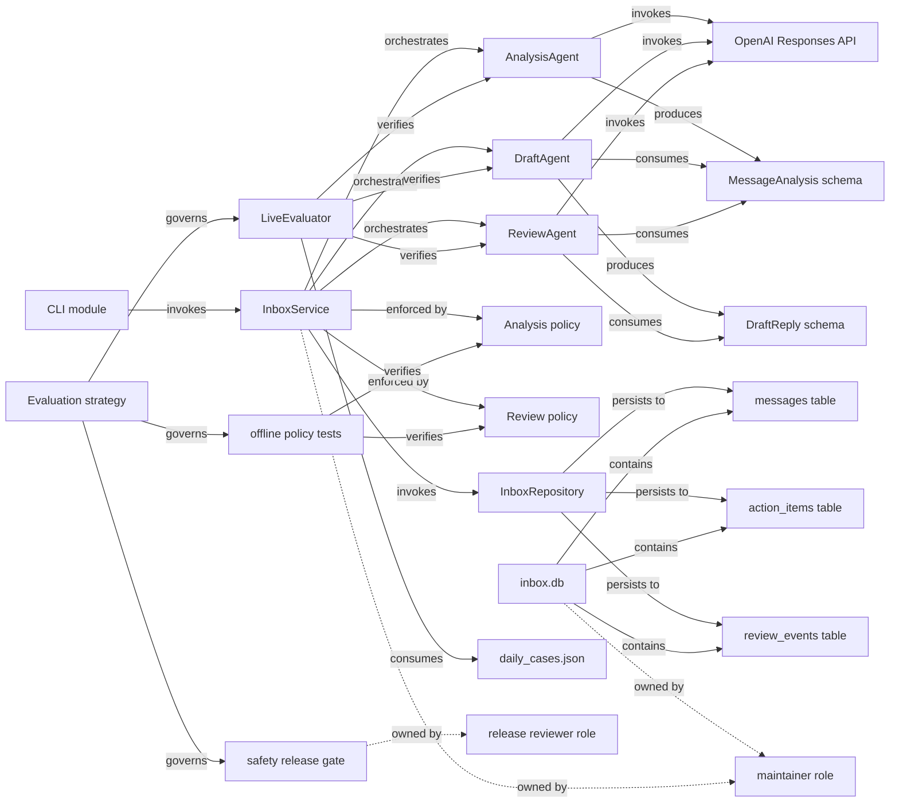

# Module 4 Practice: Inbox-to-Action Assistant Ontology

## Scope and assumptions

This ontology models the current repository as of 2026-09-15. It covers the path from manually
ingested message text through analysis, drafting, review, deterministic policy enforcement,
persistence, human review, and evaluation. Planned Gmail ingestion, a web UI, and automatic external
actions are out of scope because they do not exist yet.

No interviews or production operating data were available. Therefore, the current answer times,
participants, and confidence values below are reasoned baseline estimates for a small team. They
should be replaced with observed values during discovery. Repository facts are treated as
deterministic; ownership and business-impact judgments are marked as model-interpreted.

## Exercise 1: Ten questions first

| # | Question people need to answer | Time today (estimate) | People involved today | Confidence today |
|---|---|---:|---|---|
| Q1 | If a message-analysis schema or policy changes, which agents, persistence code, tests, fixtures, and CLI behavior are affected? | 2–4 hours | maintainer, QA/release reviewer | Medium |
| Q2 | Which components touch raw message text or derived personal data, where is it stored, and which controls govern those paths? | 3–6 hours | maintainer, security/privacy reviewer | Medium-low |
| Q3 | If a model, prompt, or safety rule changes, which evaluations must pass, who approves release, and what evidence supports the decision? | 2–5 hours plus live-eval runtime | maintainer, QA/release reviewer, product owner | Medium |
| Q4 | Why was a processed message assigned its priority and due date? | 10–30 minutes | human reviewer, maintainer if disputed | High |
| Q5 | Which persisted tasks came from a particular message, and what evidence supports each one? | 5–20 minutes | human reviewer | High |
| Q6 | What changed between the original extraction and the approved or rejected result, and who made the decision? | 5–15 minutes | human reviewer, maintainer | High |
| Q7 | Which behaviors depend on a model slated for deprecation or replacement? | 1–3 hours | maintainer, product owner | Medium |
| Q8 | Which regression cases protect a given safety rule, and where are the coverage gaps? | 1–3 hours | maintainer, QA/release reviewer | Medium |
| Q9 | Which user-visible commands write data, and which are read-only? | 30–90 minutes | maintainer, security reviewer | Medium-high |
| Q10 | If the database schema changes, which repository operations, models, and tests can break? | 1–3 hours | maintainer, QA/release reviewer | Medium |

### Ranked design brief

The three most expensive questions are:

1. **Q2 — sensitive-data flow and controls:** up to six staff-hours and the cost of a wrong privacy
   answer.
2. **Q3 — release evidence and approval:** up to five staff-hours, repeated on every model, prompt,
   policy, or schema change.
3. **Q1 — change impact:** up to four staff-hours and a meaningful risk of missing an indirect
   dependency.

An ontology earns its keep only if it makes these three questions traversable and auditable.

## Exercise 2: Entities and types

### 2a. Concrete entities

The initial slice contains 27 identifiable things across the requested planes.

| Plane | Specific entities |
|---|---|
| Code | `InboxService`, `AnalysisAgent`, `DraftAgent`, `ReviewAgent`, `ModelPool`, analysis-policy functions, review-policy function, `InboxRepository`, evaluation module, CLI module, models module, OpenAI Responses API |
| Work/governance | human reviewer role, maintainer role, release reviewer role, product owner role, evaluation strategy, safety release gate |
| Data | inbox database, `messages` table, `action_items` table, `review_events` table, processed-message schema, message-analysis schema, draft-reply schema, review-result schema, `urgent_external_action` evaluation case |

### 2b. Type definitions

Stable identifiers deliberately distinguish similarly named concepts. For example, `Agent:AnalysisAgent`
is executable behavior, while `Schema:MessageAnalysis` is its output contract.

| Type | Required properties | Stable identifier / identity rule |
|---|---|---|
| Service | name, purpose, status, criticality, owner role | `Service:<fully-qualified-class>` |
| Agent | name, responsibility, model-backed?, status, owner role | `Agent:<fully-qualified-class>` |
| CodeModule | repository, path, language, status, owner role | `CodeModule:<repository>@<path>`; path is authoritative |
| Schema | name, version/source revision, sensitivity, owner role | `Schema:<fully-qualified-model-class>` |
| PolicyRule | name, enforcement point, severity, status, owner role | `PolicyRule:<module>#<callable-or-constant>` |
| DataStore | name, engine, location, environment, owner role | `DataStore:<environment>:<canonical-path-or-resource-id>` |
| DataCollection | name, parent store, schema version, sensitivity | `DataCollection:<store-id>/<table-name>` |
| EvaluationCase | name, risk tier, source, expected behavior, status | `EvaluationCase:<fixture-path>#<case-name>` |
| EvaluationSuite | name, layer, command, blocking level, owner role | `EvaluationSuite:<repository>#<suite-name>` |
| ExternalSystem | name, provider, interface/version, data category | `ExternalSystem:<provider>/<product>/<interface>` |
| ReviewEvent | event id, message id, event type, timestamp | `ReviewEvent:<store-id>/<review_events.id>` |
| GovernanceArtifact | name, artifact kind, version/revision, owner role | `GovernanceArtifact:<repository>@<path-or-rule-name>` |
| OwnerRole | role name, scope, decision rights, status | `OwnerRole:<organization>/<normalized-role-name>` |

The stable IDs for runtime database records use the database identity rather than display text. This
prevents “the message,” “its stored result,” and the `ProcessedMessage` schema from collapsing into one
ambiguous node.

### 2c. Type-to-question check

| Question | Types required |
|---|---|
| Q1 | Schema, PolicyRule, Agent, Service, CodeModule, EvaluationSuite |
| Q2 | Schema, Agent, Service, CodeModule, DataStore, DataCollection, ExternalSystem, GovernanceArtifact, OwnerRole |
| Q3 | ExternalSystem, Agent, PolicyRule, EvaluationCase, EvaluationSuite, GovernanceArtifact, OwnerRole |
| Q4 | Schema, PolicyRule, CodeModule |
| Q5 | DataCollection, Schema |
| Q6 | ReviewEvent, DataCollection, OwnerRole |
| Q7 | ExternalSystem, Agent, Service, EvaluationSuite |
| Q8 | PolicyRule, EvaluationCase, EvaluationSuite |
| Q9 | CodeModule, Service, DataCollection |
| Q10 | DataStore, DataCollection, Schema, CodeModule, EvaluationSuite |

Every type participates in at least one question. `ReviewEvent` appears only in Q6, so it is useful but
not first-version-critical. No defined type is presently orphaned.

## Exercise 3: Relations

### 3a. Relation types

| Relation | Direction | Inverse | Cardinality |
|---|---|---|---|
| orchestrates | Service → Agent | is orchestrated by | many-to-many |
| invokes | CodeModule/Service/Agent/EvaluationSuite → Service/Agent/CodeModule/ExternalSystem | is invoked by | many-to-many |
| produces | Agent/Service → Schema | is produced by | many-to-many |
| consumes | Agent/Service/PolicyRule/EvaluationSuite → Schema/EvaluationCase | is consumed by | many-to-many |
| enforced by | Schema/Agent/Service → PolicyRule | enforces constraints on | many-to-many |
| persists to | Service/CodeModule → DataCollection | receives persistence from | many-to-many |
| contains | DataStore → DataCollection | is contained in | one-to-many |
| implemented in | Service/Agent/PolicyRule → CodeModule | implements | many-to-many |
| verified by | Service/Agent/PolicyRule/Schema → EvaluationSuite/EvaluationCase | verifies | many-to-many |
| governs | GovernanceArtifact → typed entity | is governed by | many-to-many |
| blocks release of | GovernanceArtifact → typed entity | release is blocked by | many-to-many |
| owned by | any governed entity → OwnerRole | owns | many-to-one, with possible shared ownership |

### 3b. Instantiated graph

The graph below uses 22 concrete nodes. Solid facts come directly from code/configuration. Dashed
arrows are interpreted governance assertions that need organizational confirmation.

### Assertion register and provenance

`D` means deterministic and extractable from a source of truth. `M` means model-interpreted and in
need of human confirmation. This table is also the machine-independent edge list.

| # | Assertion | Kind | Source or evidence | Confidence |
|---:|---|:---:|---|---:|
| 1 | CLI module → invokes → `InboxService` | D | `src/inbox_action/__main__.py` | 1.00 |
| 2 | `InboxService` → orchestrates → `AnalysisAgent` | D | `service.py`, constructor and `ingest` | 1.00 |
| 3 | `InboxService` → orchestrates → `DraftAgent` | D | `service.py`, constructor and conditional call | 1.00 |
| 4 | `InboxService` → orchestrates → `ReviewAgent` | D | `service.py`, constructor and `ingest` | 1.00 |
| 5 | `AnalysisAgent` → invokes → OpenAI Responses API | D | `agents.py`, `ModelPool.parse` | 1.00 |
| 6 | `DraftAgent` → invokes → OpenAI Responses API | D | `agents.py`, `ModelPool.parse` | 1.00 |
| 7 | `ReviewAgent` → invokes → OpenAI Responses API | D | `agents.py`, `ModelPool.parse` | 1.00 |
| 8 | `AnalysisAgent` → produces → `MessageAnalysis` | D | `agents.py`, `AnalysisAgent.run` return schema | 1.00 |
| 9 | `DraftAgent` → consumes → `MessageAnalysis` | D | `agents.py`, `DraftAgent.run` signature | 1.00 |
| 10 | `DraftAgent` → produces → `DraftReply` | D | `agents.py`, return schema | 1.00 |
| 11 | `ReviewAgent` → consumes → `MessageAnalysis` | D | `agents.py`, `ReviewAgent.run` signature | 1.00 |
| 12 | `ReviewAgent` → consumes → `DraftReply` | D | `agents.py`, `ReviewAgent.run` signature | 1.00 |
| 13 | `InboxService` → enforced by → analysis policy | D | `service.py`, call to `enforce_analysis_policy` | 1.00 |
| 14 | `InboxService` → enforced by → review policy | D | `service.py`, call to `enforce_review_policy` | 1.00 |
| 15 | `InboxService` → invokes → `InboxRepository` | D | `service.py`, `repository.save` | 1.00 |
| 16 | `InboxRepository` → persists to → `messages` | D | `storage.py`, SQL statements | 1.00 |
| 17 | `InboxRepository` → persists to → `action_items` | D | `storage.py`, SQL statements | 1.00 |
| 18 | `InboxRepository` → persists to → `review_events` | D | `storage.py`, SQL statements | 1.00 |
| 19 | `inbox.db` → contains → `messages` | D | default repository path and DDL in `storage.py` | 1.00 |
| 20 | `inbox.db` → contains → `action_items` | D | default repository path and DDL in `storage.py` | 1.00 |
| 21 | `inbox.db` → contains → `review_events` | D | default repository path and DDL in `storage.py` | 1.00 |
| 22 | `LiveEvaluator` → verifies → `AnalysisAgent` | D | `evaluation.py`, construction and `run_case` | 1.00 |
| 23 | `LiveEvaluator` → verifies → `DraftAgent` | D | `evaluation.py`, construction and `run_case` | 1.00 |
| 24 | `LiveEvaluator` → verifies → `ReviewAgent` | D | `evaluation.py`, construction and `run_case` | 1.00 |
| 25 | `LiveEvaluator` → consumes → `daily_cases.json` | D | CLI/evaluation loader and README command | 0.98 |
| 26 | offline policy tests → verify → analysis policy | D | `tests/test_policies.py`, test imports/calls | 1.00 |
| 27 | offline policy tests → verify → review policy | D | `tests/test_policies.py`, test imports/calls | 1.00 |
| 28 | evaluation strategy → governs → offline tests | D | `docs/EVALUATION_STRATEGY.md`, Layer 1 | 1.00 |
| 29 | evaluation strategy → governs → live evaluation | D | `docs/EVALUATION_STRATEGY.md`, Layers 3–4 | 1.00 |
| 30 | evaluation strategy → governs → safety release gate | D | strategy: safety failure blocks release | 1.00 |
| 31 | safety release gate → owned by → release reviewer role | M | inferred operating model; no `CODEOWNERS` or named process | 0.55 |
| 32 | `inbox.db` → owned by → maintainer role | M | inferred from repository maintenance responsibility | 0.60 |
| 33 | `InboxService` → owned by → maintainer role | M | inferred from repository maintenance responsibility | 0.60 |

Deterministic ratio: **30 / 33 = 90.9% D**. This is a strong technical foundation, but the three
interpreted assertions are disproportionately important because they determine accountability.

### 3c. Missing, conditional, and structural observations

- **No orphan nodes:** every instantiated node has at least one edge.
- **Conditional dependency:** `InboxService → DraftAgent` applies only when
  `MessageAnalysis.needs_reply` is true. An unconditional graph would overstate model calls, latency,
  and affected behavior.
- **Conditional model dependency:** `ModelPool` chooses the preferred model or a configured fallback
  after access failures. Impact analysis must traverse all candidates, not only the last selected one.
- **Environment qualifier:** `inbox.db` is the default path, but callers can supply another path.
  Store identity must include environment and canonical location.
- **Potentially misleading “verified by”:** a test verifies only named behavior, not an entire module.
  Production ingestion should attach test/case edges to specific rules or contracts when possible.
- **Missing data:** the repository does not encode actual people, formal approvers, deployment
  environments, data-retention policy, or runtime telemetry.
- **Longest meaningful path:** evaluation strategy → governs → live evaluator → verifies → analysis
  agent → produces → message-analysis schema → consumed by → draft agent → invokes → external API.
  This multi-hop path shows the model is more than a flat catalog.

## Exercise 4: Run the questions

| Q | Result | Traversal and answer | Ontology time | Would text search suffice? |
|---|---|---|---:|---|
| Q1 | Fully answered for current code | Start at changed Schema or PolicyRule; follow incoming `consumes`, `produces`, and `enforced by`; then incoming `orchestrates`/`invokes`; follow `verified by` to suites and cases. This yields affected agents, `InboxService`, CLI path, persistence boundary, and tests. | Seconds | No; reverse traversal across code, schema, policy, and tests is the value. |
| Q2 | Partially answered | Start at raw-message schema/input; follow `consumes` to agents/policies, `invokes` to the OpenAI API, and `persists to` to `messages`/`action_items`; follow `is governed by` and `owned by`. Technical flow is answerable, but retention policy and confirmed privacy owner are missing. | Seconds plus owner confirmation | No; the answer joins flow, storage, controls, and accountability. |
| Q3 | Partially answered | Start at changed ExternalSystem, Agent prompt, or PolicyRule; traverse incoming `invokes`, `enforced by`, and `verified by`; from suites follow `is governed by` to evaluation strategy and release gate, then `owned by`. Required suites and safety gate are known; approver is inferred. | Seconds plus approver confirmation | No; it requires dependency and governance traversal. |
| Q4 | Fully answered structurally | From processed output, traverse to `MessageAnalysis`; inspect `priority_reason`, action `date_text`, `due_date`, and `evidence_quote`; follow `enforced by` to analysis policy. The answer is model output constrained by grounded evidence and deterministic date/priority rules. | Seconds | Partly. One record can be searched, but explaining governing logic requires traversal. |
| Q5 | Fully answered | Start at `messages.id`; follow the foreign-key/persistence relation to all `action_items.message_id`; join each item back to the stored `result_json` action containing `evidence_quote`. | Seconds | No; relational identity and nested evidence must be joined. |
| Q6 | Partially answered | Start at `messages.id`; traverse to ordered `review_events`; compare `before_json` and `after_json`, read event type/note, and resolve reviewer identity when authentication metadata exists. Current system records changes but not reviewer identity. | Seconds for changes; actor unavailable | No; ordered provenance requires traversal, though actor remains a data gap. |
| Q7 | Fully answered for configured models | Start at model in `ModelPool.candidates`; follow incoming `invokes` to all three agents and `LiveEvaluator`, then to `InboxService` and CLI behaviors; traverse `verified by` for regression coverage. | Seconds | No; reverse dependency paths are required. |
| Q8 | Partially answered | Start at PolicyRule; follow `verified by` to suites/cases, then compare the policy’s behavior dimensions against case tags. Direct tests are known, but current fixture metadata is not rich enough for systematic gap analysis. | Seconds for direct coverage; manual gap review | No; gap analysis depends on rule-to-case-to-dimension relations. |
| Q9 | Fully answered | Start at each CLI command; follow `invokes` to service methods, then `invokes`/`persists to` toward storage. `ingest`, `revise`, `approve`, and `reject` write; `list`, `show`, and `history` read. `eval-live` processes without persistence. | Seconds | Mostly yes. This question alone does not justify an ontology. |
| Q10 | Fully answered | Start at DataCollection or field; follow incoming `persists to`, `contains`, and schema mappings to `InboxRepository`, models, service methods, and persistence tests. | Seconds | No; reverse impact crosses DDL, serialization, models, and tests. |

Summary: **6 fully answered and 4 partially answered**. Nine of ten benefit from relations; **8 genuinely require multi-hop traversal** (Q1, Q2, Q3,
Q5, Q6, Q7, Q8, Q10). That count is the business case. Q9 is a documentation/search question and
should not be used to inflate the case for an ontology.

The partial-answer gaps are:

- Q2: a confirmed privacy owner and retention/deletion governance artifacts.
- Q3: a formally assigned release approver.
- Q6: authenticated actor identity on review events.
- Q8: explicit case tags and rule-to-case coverage edges.

## Exercise 5: Provenance and trust

The assertion register marks every graph edge. The graph is 90.9% deterministic, but a high ratio does
not make the ownership claims safe.

### The three most important interpreted assertions

| M assertion | If wrong | Who acts on it | Cost of error | Required control |
|---|---|---|---|---|
| Safety release gate is owned by the release reviewer role | A change may ship without a qualified safety decision, or work may stall waiting for the wrong person | maintainer and release operator | Unsafe drafts/actions, rollback, loss of trust | Product owner must name the accountable role; protect releases with required approval |
| Database is owned by the maintainer role | Retention, backup, access, or migration work may be neglected | maintainer, security/privacy reviewer | Data loss or privacy exposure | Record a RACI owner and retention policy; require quarterly attestation |
| `InboxService` is owned by the maintainer role | Impact questions and incidents are routed incorrectly | engineering/release team | Delayed fixes and unreviewed changes | Add `CODEOWNERS` or equivalent service catalog ownership |

These assertions need human owners and verification, not merely confidence scores. The best way to make
them deterministic is to add version-controlled ownership metadata (`CODEOWNERS` or a small service
catalog), a release approval rule, and authenticated actor fields in `review_events`.

## Exercise 6: Staleness plan

| Type | What changes it | Detection | Acceptable staleness | Divergence check |
|---|---|---|---|---|
| Service | constructor/orchestration or public-method change | scan Python AST on every merge | 1 day | compare discovered service calls with catalog edges in CI |
| Agent | prompt, schema binding, or model-call change | AST/config scan on every merge | 1 day | hash prompt and signature; fail CI on unreviewed mismatch |
| CodeModule | add, move, rename, or delete file | Git diff/webhook | Minutes to 1 day | verify every catalog path exists at target commit |
| Schema | Pydantic model/field change | AST or JSON-schema generation in CI | 1 day | compare generated schema hash and stored ontology version |
| PolicyRule | callable, constant, or enforcement-site change | AST scan plus policy tests | 1 day | require each discovered policy callable to have an edge and test |
| DataStore | path/engine/environment change | config scan at deploy and daily inventory | 1 day | compare runtime connection target with registered store ID |
| DataCollection | DDL or migration change | parse migrations/DDL in CI | Before deployment | introspect SQLite schema and diff expected columns/FKs |
| EvaluationCase | fixture add/edit/delete | Git diff on every merge | 1 day | validate names, tags, expectations, and referenced rules |
| EvaluationSuite | command, test, or gate change | CI configuration scan | 1 day | compare collected tests and required checks with catalog |
| ExternalSystem | SDK/API/model version change or provider notice | dependency scan per merge; provider review weekly | 1 day for configured model changes; 1 week for notices | compare lock/config candidates with catalog; alert on deprecated model |
| ReviewEvent | user revision/decision | synchronous database write | Seconds | reconcile event count and latest status; check immutable snapshots |
| GovernanceArtifact | policy, strategy, or release-rule change | Git/branch-protection webhook | 1 day | require revision, owner, and review date; flag overdue review |
| OwnerRole | staffing/RACI change | HR/service-catalog event plus monthly review | 1 week | flag missing/inactive owners and request quarterly attestation |

### Ownership after handover

The proposed accountable owner is the **Inbox Assistant technical product owner**. The repository
maintainer is responsible for automated technical extraction; the release reviewer is responsible for
safety-gate and ownership attestations. Their incentive is direct: stale technical edges cause missed
change impacts and failed releases; stale governance edges cause approval delays or unsafe releases.

This role assignment is a proposal, not a fact. If the organization cannot name and empower a technical
product owner, connect ontology checks to CI, and make release approval depend on current ownership,
the honest recommendation changes to **do not build it yet**.

## Exercise 7: One-page recommendation

### Recommendation: build a narrower, generated first version

The domain has a real traversal problem, but it does not justify a general-purpose knowledge graph yet.
Build a repository-generated dependency and governance manifest first. The three costly questions are
sensitive-data flow (3–6 hours today), release evidence and approval (2–5 hours), and schema/policy
change impact (2–4 hours). A small ontology can reduce the technical portion of each answer to seconds
by traversing from schemas and policies to agents, external systems, storage, evaluations, release
gates, and owners.

**First-version scope.** Include only 10 types: Service, Agent, CodeModule, Schema, PolicyRule,
DataStore, DataCollection, EvaluationCase/Suite, ExternalSystem, and OwnerRole/GovernanceArtifact.
ReviewEvent instances should remain in SQLite and be queried on demand rather than copied into a graph.
Implement the relations `orchestrates`, `invokes`, `produces`, `consumes`, `enforced by`, `persists to`,
`implemented in`, `verified by`, `governs`, and `owned by`. Keep environment and conditional qualifiers.

**Where structure comes from.** Parse Python imports, class construction, function signatures, Pydantic
models, SQLite DDL, test imports, fixture names/tags, project configuration, and CI/release rules. Read
the evaluation strategy as a versioned governance artifact. Add one small human-maintained ownership
file for accountable roles. The prototype demonstrates 90.9% deterministic assertions; after adding
the ownership file, the target should be at least 95% deterministic for first-version edges.

**Cost.** Estimate 4–6 engineering days for extractors, a normalized manifest, validation, CI drift
checks, and three saved queries; add 1–2 days if an interactive graph UI is demanded. Ongoing cost is
roughly 1–2 maintainer hours per month plus a quarterly 30-minute owner attestation. These are planning
estimates and should be validated in a one-week spike.

**Operation and handover.** The Inbox Assistant technical product owner is accountable. Repository
merges trigger technical refreshes; schema/DDL changes must refresh before deployment; model/provider
changes trigger dependency and evaluation traversal; role changes trigger ownership review. CI rejects
missing paths, unregistered schemas/policies, and missing required tests. A monthly report flags stale
external-system metadata, while quarterly attestation validates governance and ownership.

**Decision.** Build the narrow version only if it is generated from source and tied to CI and release
decisions. Do not hand-maintain a broad graph and do not add a graph database in phase one. After 60
days, measure answer time, missed impacted components, stale-edge rate, and actual query frequency. Add
a graph backend only if multi-repository scale or interactive traversal makes the manifest inadequate.
If no accountable product owner accepts the staleness duties, stop after the spike and retain the
generated dependency report as documentation rather than calling it an operational ontology.

## Acceptance check

- Three expensive questions form the design brief and require traversal.
- Thirteen types have stable identity rules; instances are not modeled as types.
- Twelve directional relations have inverses and cardinalities.
- Twenty-two instantiated nodes and 33 provenance-marked assertions form a non-flat graph.
- All ten questions were walked; eight genuinely require multi-hop traversal.
- The deterministic ratio is explicit: 30/33, or 90.9%.
- Every type has a trigger, detection method, staleness tolerance, and divergence check.
- Ownership is named as a role and clearly labeled as a proposal requiring confirmation.
- The recommendation takes a position: build a narrow, generated version; otherwise do not build yet.
